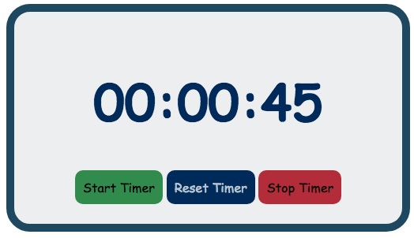

# Simple Timer with Start, Stop and Reset buttons.

### Using the JavaScript setInterval() method, the clock starts counting up on a click of the start timer button.

### The timer is stopped using the clearInterval() method. To get the timer back to zero, hours minutes and seconds are set back to zero.

### To avoid starting more than one interval (which can really mess up the time because they run all at the same time) there is a conditional on the startTimer() function that won't start it again if it is already running.

#### Written in vanilla JavaScript.

##### Built with help from MDN and many google searches.
